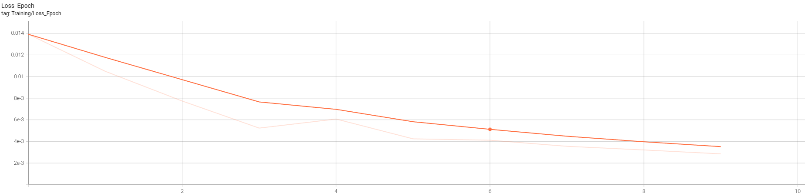
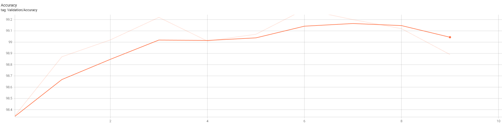

# MNIST Handwritten Digit Classifier

Deep Learning project for Udacity Deep Learning Nanodegree - CNN-based digit classification achieving 98.89% accuracy.

## Project Overview

Implementation of a Convolutional Neural Network (CNN) to classify handwritten digits from the MNIST dataset.

## Results

- **Test Accuracy:** 98.89%
- **Architecture:** 2 Conv layers + 2 FC layers
- **Training:** 10 epochs on RTX 5080

## Visualizations

### Training Loss


### Validation Accuracy


## Model Architecture

- Conv2D (1 → 32 channels)
- MaxPool2D
- Conv2D (32 → 64 channels)
- MaxPool2D
- Fully Connected (3136 → 128)
- Dropout (0.25)
- Output (128 → 10 classes)

## Requirements
```
torch
torchvision
matplotlib
numpy
tensorboard
```

## Training
```bash
jupyter notebook MNIST_Handwritten_Digits-STARTER.ipynb
```

## TensorBoard

Training metrics tracked with TensorBoard:
```bash
tensorboard --logdir runs
```

## Files

- `MNIST_Handwritten_Digits-STARTER.ipynb` - Main notebook
- `mnist_cnn_model.pth` - Trained model weights
- `loss_epoch.png` - Training loss plot
- `accuracy.png` - Validation accuracy plot

## Author

Daniel Lawitzke - Udacity Deep Learning Nanodegree
